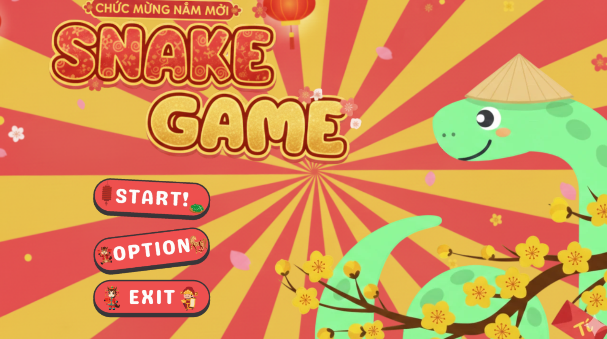
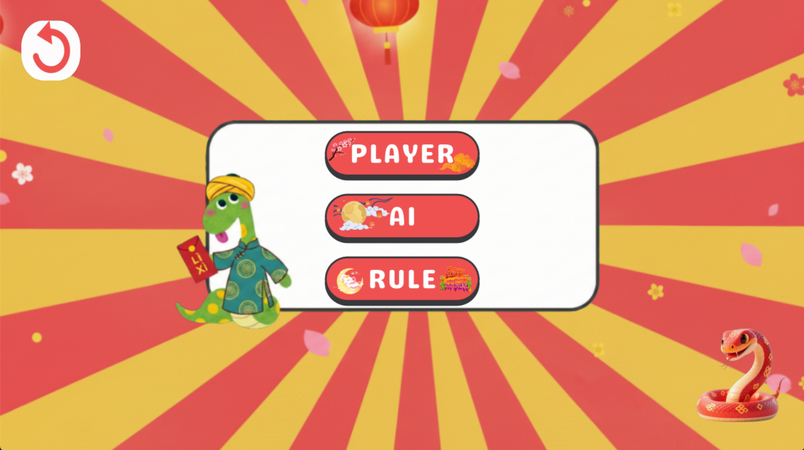
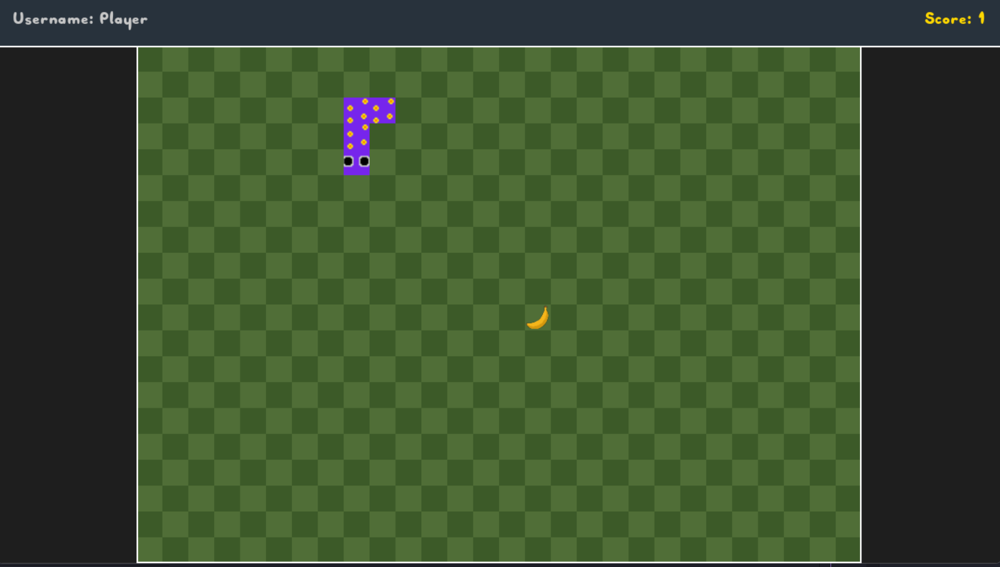
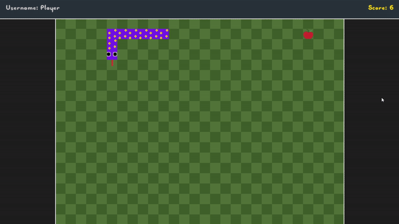
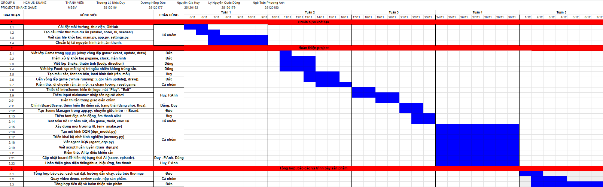

# 🐍 Game rắn săn mồi
   
## ✊ Giới thiệu
Trò chơi này được xây dựng dựa trên game rắn săn mồi cổ điển và tích hợp thêm các tính năng khác để tăng trải nghiệm người chơi. Trò chơi được tạo ra bằng ngôn ngữ Python và sử dụng framework PyGame.
## 🎮 Giao diện 



## ✨ Tính năng nổi bật
- 👤 🤖 Chế độ chơi đa dạng: người chơi được quyền chọn kích thước bàn chơi cũng như chế độ tự chơi hoặc chế độ bot chơi.
- 🖼️  Hình ảnh đẹp mắt: giao diện được thiết kế theo phong cách tết mang lại không khí vui vẻ khi chơi, người chơi còn được quyền chọn giao diện của rắn.
- 🔊  Âm nhạc sống động: tích hợp âm nhạc khi chơi và ăn thức ăn đem lại trải nghiệm thú vị.
- 🌍 Đa ngôn ngữ: chuyển đổi ngôn ngữ giữa tiếng Việt và tiếng Anh. Đem lại trải nghiệm tốt nhất cho các tệp người chơi khác nhau.
## 📂 Cấu trúc thư mục
```
snake_game/
├── main.py                # Điểm khởi chạy chính, khởi tạo giao diện và bắt đầu trò chơi
├── requirements.txt       # Danh sách thư viện cần thiết (torch, numpy, pygame, tqdm)
├── README.md              # Tài liệu mô tả tổng quan và hướng dẫn dự án
└── snake/                 # Thư mục mã nguồn chính
    ├── app.py             # Lớp Game điều phối vòng lặp chính và các module
    ├── settings.py        # Định nghĩa các tham số cấu hình (màn hình, tốc độ, âm lượng)
    ├── skin.py            # Quản lý tải và hiển thị các loại skin cho rắn
    ├── core/              # Chứa các thành phần logic vật lý cốt lõi
    │   ├── snake.py       # Định nghĩa cấu trúc dữ liệu và hành vi của rắn
    │   └── food.py        # Quản lý việc sinh mồi và logic va chạm
    ├── rl/                # Module Trí tuệ nhân tạo (Reinforcement Learning)
    │   ├── agent_dqn.py   # Agent điều khiển AI, tích hợp thuật toán Flood Fill
    │   ├── dqn_model.py   # Mạng Neural Dueling DQN (Value & Advantage streams)
    │   ├── train_dqn.py   # Kịch bản thực hiện quy trình huấn luyện
    │   ├── helper.py      # Các hàm bổ trợ vẽ biểu đồ và log dữ liệu
    │   └── model.pth      # File lưu trữ trọng số của mô hình AI đã huấn luyện
    ├── scenes/            # Quản lý các màn hình giao diện người dùng
    │   ├── intro.py       # Giao diện màn hình chào và chọn chế độ
    │   └── board.py       # Giao diện bàn cờ chơi game và mô phỏng AI
    ├── images/            # Tài nguyên hình ảnh (Foods, Skins, UI Icons)
    └── sound/             # Tài nguyên âm thanh (Music, SFX)
  ```
 ## 🚀 Cài đặt
  1. Thiết lập môi trường
  ```
  Invoke-Webrequest -URI https://micro.mamba.pm/api/micromamba/win-64/latest -OutFile micromamba.tar.bz2
tar xf micromamba.tar.bz2

MOVE -Force Library\bin\micromamba.exe micromamba.exe
.\micromamba.exe --help

$Env:MAMBA_ROOT_PREFIX="C:\Your\Root\Prefix"

.\micromamba.exe shell hook -s powershell | Out-String | Invoke-Expression

.\micromamba.exe shell init -s powershell -r C:\Your\Root\Prefix
micromamba create -f ./test/env_win.yaml -y
micromamba activate yourenv
  ```
  2. Tải mã nguồn
  ```git
  git clone https://github.com/DuongHongDuc-az/Snake-Game.git
  cd snake_game/snake_game
  ```
  3. Cài đặt môi trường
  ```terminal
  pip install -r requirements.txt
  ```
## ✈️ Cách sử dụng
 1. Chạy trò chơi
 ```terminal
 python main.py
 ```
 2. Huấn luyện agent mới
 ```
 python snake/rl/train_dqn.py
 ```
 ## 🧠 Chi tiết kĩ thuật AI

 Hệ thống huấn luyện AI chơi Snake Game xây dựng một Agent tự động chơi. Agent học hỏi thông qua cơ chế Reinforcement Learning, cụ thể là dùng thuật toán Deep Q-Network (sự kết hợp giữa Q-Learning và Deep Neural Network). Hệ thống sử dụng thư viện PyTorch để xây dựng Neural Network với Pygame làm môi trường.
**Quy trình huấn luyện:**
- Lấy trạng thái hiện tại
-  Thực hiện nước đi tiếp theo (ngẫu nhiên hoặc từ Neural Network) dựa trên trạng thái hiện tại.
- Nhận về phản hồi: Chỉ số reward (thưởng/ phạt), game_over (màn chơi kết thúc chưa) và score (điểm số).
- Lấy trạng thái mới.
- Học ngắn hạn (train_short_memory).
- Lưu bộ [Trạng thái cũ, hành động, reward, trạng thái mới, game_over] vào kho lưu trữ.
- Nếu màn chơi kết thúc thì học dài hạn (train_long_memory)

 ## 💻 Công nghệ sử dụng
Ngôn ngữ: Python
Đồ họa, âm thanh: Pygame
Trí tuệ nhân tạo: Pytorch
##  👥 Tác giả thực hiện
**HCMUS-SNAKE - GROUP 6 - 25CTT3**
- Trương Lý Nhật Duy 

- Dương Hồng Đức - 25120177

- Nguyễn Gia Huy

- Lý Nguyễn Quốc Dũng

- Ngô Trần Phương Anh

 **Giảng viên hướng dẫn: thầy Lê Đức Khoan**
 ## 📉 Gnatt Chart
